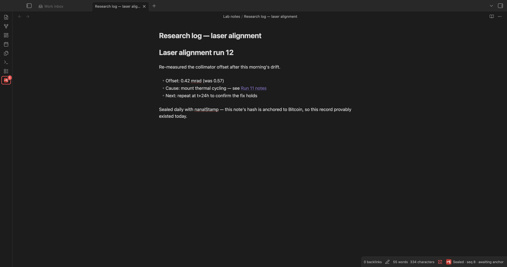
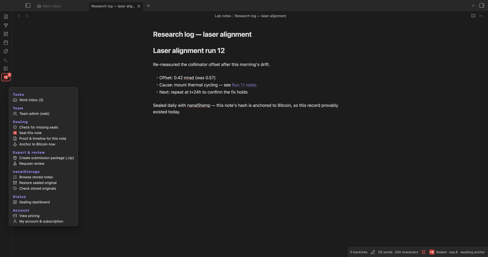
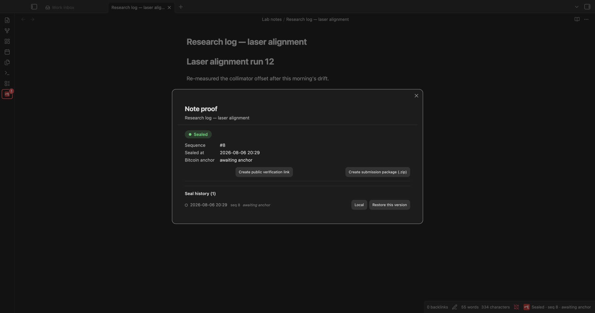

# nanalStamp

**English**: [README.md](README.md) · **한국어**: 이 문서

노트를 위·변조 방지 타임스탬프로 봉인합니다 — 비트코인 블록체인에 앵커링되며, **노트 내용은 단 한 글자도 업로드되지 않습니다.**

nanalStamp은 선택한 노트를 지켜보다가 노트가 정착되는 순간(타이핑을 멈추거나, 다른 노트로 넘어가거나, Obsidian을 닫을 때) **기기 안에서 SHA-256 해시를 계산**해 그 해시만 nanalStamp 서버로 보냅니다. 서버는 해시들을 사슬로 묶고 항목마다 서명한 뒤, 주기적으로 사슬 머리를 [OpenTimestamps](https://opentimestamps.org)를 통해 비트코인에 앵커링합니다. 그 결과는 "이 노트가 이 형태로 이 시점에 존재했다"는, **nanalStamp을 신뢰하지 않아도 독립적으로 검증 가능한 증명**입니다.

| 모든 기능이 메뉴 하나에 | 노트별 증명·이력 |
|---|---|
|  |  |

## 왜 오늘 시작해야 하나 — 과거는 소급해서 증명할 수 없습니다

nanalStamp의 가치는 "이 파일이 한 번 존재했다"가 아닙니다. **이 노트를 매일 꾸준히 작성해 왔고, 그 편집 이력이 끊김 없는 사슬**이라는 것 — 나중에 한꺼번에 만들어 날짜를 소급한 것이 아니라는 것 — 을 증명하는 데 있습니다.

그 연속성은 **소급해서 만들 수 없습니다.** 각 날짜의 상태는 그날의 비트코인 블록에 **독립적으로** 고정되고, 이미 채굴된 블록에 앵커를 끼워 넣을 방법은 없습니다. 따라서 증명할 수 있는 기간은 **봉인을 시작한 순간부터 앞으로**만 쌓입니다 — 미루는 하루하루가 영영 돌려받을 수 없는 증명 가능 기간입니다.

> **중요한 노트라면 — 연구기록, 발명 기록, 저널 — 나중이 아니라 지금 봉인하세요.** 증명은 실제로 쌓아온 기간만큼만 존재합니다.

## 이 증명의 성격 (되는 것과 안 되는 것)

nanalStamp은 강한 위·변조 증거력을 갖춘 **전자 타임스탬프 / 존재증명**을 제공합니다: 해시 사슬 + 서명 + 비트코인 앵커, 그리고 우리를 신뢰하지 않아도 되는 독립 검증. 기록의 무결성과 시점에 대한 **보강 증거로 채택될 수 있도록** 설계되었습니다(법원이 이미 인정하는 해시 기반 검증 방식과 정합합니다).

다만 **정부 공인·"qualified" 타임스탬프가 아니며 그러한 지위를 주장하지 않습니다.** 개별 분쟁에서의 증거 가치 판단은 해당 법원·기관의 몫입니다.

## 프라이버시와 네트워크 사용 (꼭 읽어주세요)

제3자 분석·추적·텔레메트리는 일절 없습니다. 플러그인이 접속할 수 있는 호스트는 아래가 **전부**입니다:

| 호스트 | 언제 | 무엇이 전송되나 |
|---|---|---|
| `api.nanalstamp.com` | 항상 (봉인) | 내용 해시 + 경로 해시 + 시각 + API 키 — **해시만, 내용은 절대 아님** |
| `api.nanalstamp.com` | **원문 보관**(유료) 구독 시에만 | 노트·첨부 원문 — **업로드 전에 기기에서 암호화** (복원을 보장하기 위해 키는 서비스가 관리) |
| `mempool.space` | **제출 패키지**를 만들 때만 | 내 증명에 이미 들어 있는 비트코인 블록 번호(공개 숫자) 조회 — vault 데이터 없음 |
| `github.com` / `api.github.com` | 선택형 **GitHub 오프사이트 보관**을 연결한 경우에만 | 원문 파일을 **본인 소유** GitHub 저장소로 push (기기 인증 플로, 토큰은 로컬 저장) |
| `nanalstamp.com` | 요금·계정·결제 링크 | 외부 브라우저에서 열림 — 플러그인 자체는 아무것도 보내지 않음 |

API 호스트는 `api.nanalstamp.com`으로 고정되어 있습니다 — 데이터를 다른 곳으로 보내는 설정 자체가 없습니다.

**봉인(기본 동작) 중 기기를 떠나는 것:**
- 노트 내용의 **SHA-256 해시** (64자 다이제스트 — 해시로부터 내용을 복원할 수 없습니다)
- 파일 경로의 **SHA-256 해시** — 폴더·파일 **이름**조차 읽을 수 있는 형태로는 나가지 않습니다
- 클라이언트 시각, 그리고 로그인했다면 API 키

**노트 원문이 업로드되는 것은 보관 기능을 직접 켠 경우뿐입니다**(유료 원문 보관 또는 본인 저장소로의 GitHub 보관) — 봉인 자체는 내용도, 읽을 수 있는 파일명도, 그 밖의 vault 데이터도 보내지 않습니다.

**요청이 발생하는 시점:**
- 감시 중인 노트가 정착될 때(디바운스), 노트를 떠나거나 닫을 때, 지난 실행 이후 바뀐 노트의 "따라잡기" 스윕
- 명령을 직접 실행할 때(증명서 발급, 공개 링크, 지금 앵커, 제출 패키지, 요금·계정 열기)
- 봉인이 전송되지 못한 채 Obsidian을 종료할 때 — 마지막 봉인이 `navigator.sendBeacon`으로 나갑니다(앱 종료 중에도 완료가 보장되는 유일한 전송 수단). 같은 API 호스트, 해시 전용 페이로드이며 분석용이 아닙니다(플러그인에는 분석 코드가 전혀 없습니다).

전송을 전부 멈추려면 플러그인을 비활성화하면 됩니다(**설정 → 커뮤니티 플러그인 → nanalStamp**). 감시 범위는 포함/제외 폴더 설정으로 제한할 수 있습니다.

## 계정과 결제 (선택)

- 봉인은 무료 API 키로 동작합니다. 로그인은 선택이며 키를 자동으로 받아오는 용도입니다.
- **공식 증명서(PDF)** 와 **공개 검증 링크**는 유료 기능입니다. 결제 명령은 외부 결제 페이지를 브라우저에서 엽니다 — Obsidian 안에서 결제가 일어나지 않습니다.
- 요금과 계정 관리는 [nanalstamp.com](https://nanalstamp.com)에 있습니다.

## 검증은 어떻게 이루어지나

- **내용 증명** — 내용 해시가 노트에 *무엇이* 있었는지를 증명합니다. 노트를 공개하면 누구나 다시 해시해 대조할 수 있습니다.
- **경로 커밋먼트** — 경로 해시는 커밋먼트입니다. 나중에 *어느* 노트(경로/이름)에 대한 증명인지 밝히고 싶으면 경로를 공개하고, 검증자가 `SHA-256("nanalstamp/path/v1\n" + 경로)`를 재계산해 대조합니다.
- **사슬 + 서명** — 각 항목은 `user | seq | prev_hash | content_hash | path_hash | received_at`을 묶어 서버의 Ed25519 키로 서명되고 직전 항목과 연결됩니다. 순서를 바꾸거나 날짜를 소급하면 사슬이 끊어집니다.
- **비트코인 앵커** — 사슬 머리가 OpenTimestamps에 제출되고, 확정되면 비트코인 블록 번호를 갖습니다. 서버를 신뢰하지 않고도 독립 검증이 가능합니다.

## 사용법

1. 플러그인을 설치하고 활성화합니다.
2. **설정 → nanalStamp**에서 API 키를 붙여넣거나 로그인해 자동으로 받습니다.
3. (선택) **포함 폴더 / 제외 폴더**로 감시 범위를 제한합니다.
4. 평소처럼 쓰면 됩니다. 노트는 자동으로 봉인되고, 상태바에 씰 아이콘과 누적 건수가 표시됩니다.

### 명령

- **이 노트 봉인** — 즉시 봉인
- **지금 비트코인에 앵커** — 현재 사슬 머리를 비트코인에 제출
- **증명 내보내기(.nanalproof)** — 활성 노트의 휴대용 증명 파일 저장
- **공식 증명서 발급(PDF)** — 유료(증명서 크레딧 필요)
- **공개 검증 링크 만들기** — 유료(Pro)
- **요금제 보기 / 내 계정·구독** — 웹사이트 열기

### 설정

| 설정 | 용도 |
|---|---|
| 계정 / API 키 | 로그인으로 키 자동 수령 또는 직접 붙여넣기. 팀 폴더용 팀 계정을 따로 연결할 수 있습니다. |
| 봉인 범위 | 포함/제외 폴더, vault 전체 모드, 첨부 봉인 여부 |
| 첨부 크기 상한 | 요금제별 표시. 초과 첨부는 봉인 대신 보류됩니다. |
| 업무 요청함 | 선택형 팀 업무함과 시스템 알림 |
| 저장 | 원문 보관 백엔드와 로컬 아카이브 폴더(vault 밖 git 저장소) |
| 증명 원장·백필 | 검증된 증명 번들이 저장될 위치, 설치 전 노트의 따라잡기 봉인 |
| GitHub 내보내기(고급) | 원문을 본인 저장소로 보내는 선택형 오프사이트 사본 |
| 템플릿 · 언어 | 노트/digest 템플릿과 폴더, UI 언어 |

봉인 타이밍은 자동이며 설정할 수 없습니다: 타이핑을 멈추고 약 5초 뒤 봉인되고, 노트당 최대 5분에 1회이며, 실패한 전송은 30초마다 재시도됩니다.

## 지금은 데스크톱 전용

nanalStamp은 현재 **데스크톱 전용**입니다. 로컬 원문 아카이브가 vault 밖에 git 저장소를 유지하는데, 여기에 데스크톱 파일시스템 접근이 필요합니다. 모바일은 데스크톱 수준의 검증을 마친 뒤 지원할 계획입니다.

## 독립 검증

검증은 nanalStamp 서버를 신뢰하지 않아도 됩니다: 내려받는 검증기, 표준 도구(`sha256sum`, OpenTimestamps 클라이언트), 공개 `/check` 페이지 중 무엇으로도 증명을 독립적으로 확인할 수 있습니다.

## 라이선스

[GPL-3.0](LICENSE) © 2026 nanalLabs — 자유롭게 사용·연구·수정할 수 있으며, 수정본을 배포할 때는 같은 라이선스로 소스를 공개해야 합니다.
